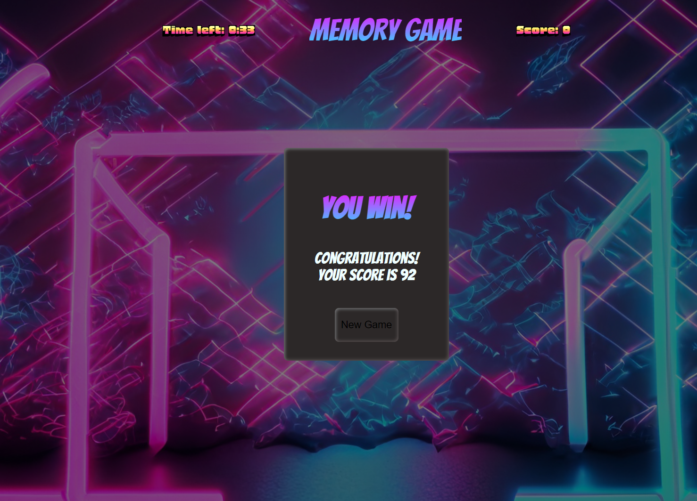

# Dynamic Card-Matching Game

  

## Introduction
Our Dynamic Card-Matching Game is an interactive web-based game developed using TypeScript, HTML, and CSS. This game offers a fun and challenging way to test your memory and quick-thinking skills. It features a vibrant design, intuitive gameplay, and is perfect for players of all ages.
<p align="center">
  
  
  
</p>
## Features
- **Random Card Selection**: Each game session presents a new challenge with cards shuffled and placed randomly.
- **Score Tracking**: Keep track of your performance with an ongoing score system.
- **Countdown Timer**: Adds an exciting challenge by limiting the time to match cards.
- **Responsive Design**: Enjoy the game on various devices, thanks to a mobile-friendly and responsive layout.
- **Future Enhancements**:
  - *High Score Leaderboard*: Compete with other players and climb the ranks on the leaderboard.
  - *User Accounts*: Create your account to save your scores and progress.

## Getting Started
To start playing the game, simply clone this repository and open the `index.html` file in your browser.

```bash
git clone https://github.com/TheMisterPin/dynamic-card-game.git
cd dynamic-card-game
